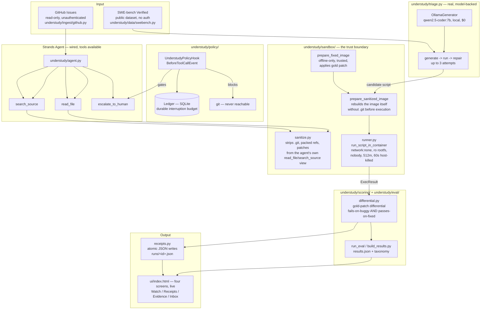

# Architecture

Status (2026-09-12): the execution and safety layer, the real triage loop, and the real
scoring pipeline are built and verified end-to-end against real data, not a mock or a
throwaway script. The model is local Ollama (`qwen2.5-coder:7b`), not Bedrock — AWS
Bedrock access on this account is broken, so the fallback is local inference rather than a
paid API. The four UI screens are built and live. Nothing in this diagram is aspirational;
every box either exists and is tested, or is explicitly marked not yet built.

**Real result on this pipeline, N=16 real SWE-bench Verified instances (2026-09-12): 3/16
(19%) reproduced by the gold-patch differential**, vs. 14/16 (88%) a naive exit-code check
would have wrongly claimed. See `results.json` for the full breakdown.

## Trust boundaries

1. **The agent never sees a gold patch.** `Instance` (agent-facing) has no
   field for one — it's a type-level guarantee, not a convention. Only
   `ScoringCase`, used exclusively by the offline scorer, carries it.
2. **The generated script never sees `.git`.** `git` is blocked in
   `UnderstudyPolicyHook` for a Strands agent invoking tools, and the
   sanitizer separately strips `.git`/packed-refs/patches from the tree the
   agent's `read_file`/`search_source` tools can see. Neither of those
   covers the container the script actually executes in — that path never
   goes through a tool call — so every such container is rebuilt from a
   `.git`-stripped image first (`prepare_sanitized_image`) before the
   script ever runs in it, for both the buggy-commit run and the
   gold-patch-applied run.
3. **Untrusted code (the generated reproduction script) always runs under
   full lockdown**: no network, read-only root filesystem, capped memory/
   processes/user, host-enforced timeout that actually kills the container
   (not just the CLI process — that distinction matters, and is covered by
   a dedicated test).
4. **Applying the gold patch is a separate, trusted lifecycle** from
   executing untrusted code. It happens in a throwaway writable container
   that gets committed to a new image and then discarded; the untrusted
   script only ever runs afterward, under the same lockdown as the buggy
   run, against that image.

## What's left

The video recording and final submission on Devpost. Everything else — the real triage
loop, the real scoring pipeline, the eval data, the four UI screens, the fork
(https://github.com/AshrafAhmed9/tqdm) with 3 real issues and 3 real posted verdicts — is
built. See `understudy/fork_demo/README.md`.

**AgentCore deployment (Stream E) is confirmed blocked at the account level, not attempted
further.** Verified 2026-09-12: even after attaching a working `bedrock-agentcore:*` IAM
policy directly to the user, every AgentCore control-plane call returns
`AccessDeniedException`. That's the same shape as the Bedrock `ValidationException` — an
account-wide restriction sitting above IAM (an SCP or permissions boundary), not a
permissions gap we can fix from inside the account. Two independent Bedrock-family services
blocked the same way is enough evidence to stop chasing this and disclose it as a known
limitation rather than spend more of the remaining time on it.
