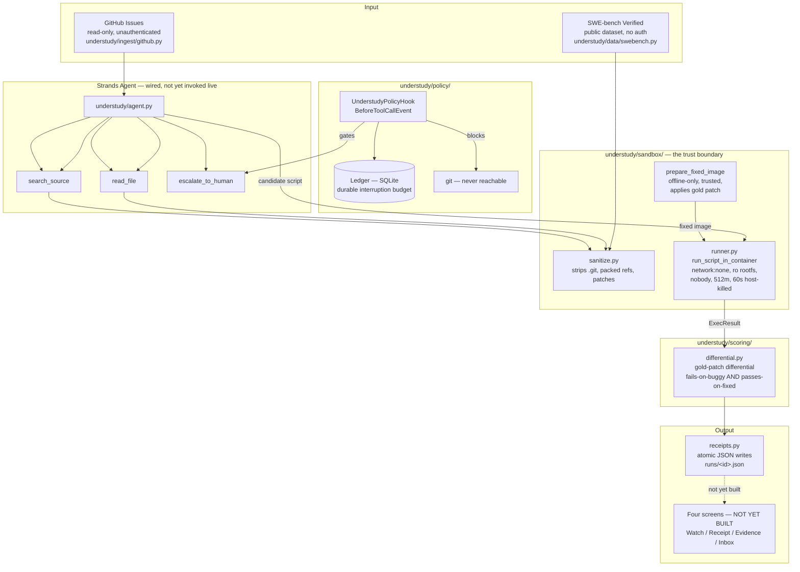

# Architecture

Status: the execution and safety layer below is built and verified end-to-end
against real data (see DEV_README.md). The agent reasoning loop is wired but
has never made a model call — that needs AWS credentials Ashraf hasn't
provided yet. Nothing in this diagram is aspirational; every box either
exists and is tested, or is explicitly marked not yet built.

## Trust boundaries

1. **The agent never sees a gold patch.** `Instance` (agent-facing) has no
   field for one — it's a type-level guarantee, not a convention. Only
   `ScoringCase`, used exclusively by the offline scorer, carries it.
2. **The agent never runs `git`.** Blocked in `UnderstudyPolicyHook`, and
   the sanitizer separately strips `.git`/packed-refs/patches from the tree
   the agent's tools can see — two independent layers, because blocking the
   `git` executable alone is not sufficient (the fix commit is reachable by
   reading objects directly).
3. **Untrusted code (the generated reproduction script) always runs under
   full lockdown**: no network, read-only root filesystem, capped memory/
   processes/user, host-enforced timeout that actually kills the container
   (not just the CLI process — verified this distinction matters, see
   DEV_README.md).
4. **Applying the gold patch is a separate, trusted lifecycle** from
   executing untrusted code. It happens in a throwaway writable container
   that gets committed to a new image and then discarded; the untrusted
   script only ever runs afterward, under the same lockdown as the buggy
   run, against that image.

## What still needs Ashraf

AWS credentials (nothing above has made a real model call), a decision on
which repo to fork for the live autonomous-posting demo, and everything
downstream: the eval matrix at scale, the four UI screens against real
results, AgentCore deployment, the video, the Builder posts.
